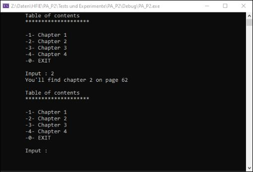

# Anwendungsbeispiel Zeiger

Mit der vorliegenden Aufgabe soll durch einfache Mittel und geringen Programmieraufwand ein konkretes Anwendungsbeispiel für die Verwendung von Zeigern demonstriert werden.

## Vorbereitung

Erstellen Sie in Visual Studio ein neues Projekt für die Bearbeitung dieser Aufgabe. Schreiben Sie sämtlichen Code, welcher für die Bearbeitung dieser Aufgabe notwendig ist direkt in die main Funktion des neu erstellten Projekts.

## Vorgehensweise

Bearbeiten Sie diese Aufgabe alleine und möglichst selbständig, d.h. ohne Verwendung von Hilfsmitteln.

## Aufgabenstellung

Erstellen Sie ein Programm, welches als interaktives Inhaltsverzeichnis funktioniert. Im Rahmen dieser Aufgabe sollen Benutzerinnen und Benutzer die Kapitelnummer eines (fiktiven) Buches eingeben können um die Seitenzahl dieses Kapitels angezeigt zu erhalten. Etwas realistischer könnte das Nachschlagen einer Telefonnummer in einem Adressverzeichnis oder das Auffinden des Einkaufspreises von einem Produkt mit bekannter Artikelnummer ausfallen.

Das Programm soll nach dem Start solange für Auskünfte zur Verfügung stehen, bis dieses durch die Eingabe eines entsprechenden Codes beendet wird. Im nachfolgenden Screenshot wird dafür die Zahl 0 verwendet.

Die Anzahl der Kapitel sowie die zugehörigen Seitenzahlen sind für die Umsetzung dieser Aufgabe nicht relevant. Wählen Sie dazu selbständig einige fiktive Seitenzahlen (wieso nicht die kleinsten Primzahlen in jedem Hunderterraum?). Die Informationen zu den vorhandenen Kapiteln und zugehörigen Seitenzahlen sollen im Programm als konstante Werte hinterlegt sein.

Für das Einlesen der Benutzereingabe sowie für die Zwischenspeicherung bzw. Ausgabe der relevanten Informationen sollen wo möglich (und sinnvoll) Zeiger bzw. entsprechende Operatoren (z.B.& und *) verwendet werden.

Als Hilfestellung und/oder Inspiration für die Bearbeitung dieser Aufgabe kann der untenstehende Screenshot verwendet werden.

